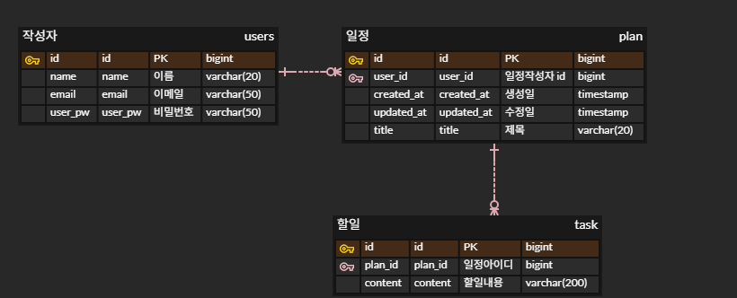

# MyPlanner

### API 명세서

| 기능   | Method | URL                 | request  | response | 상태코드 |
|------|--------|---------------------|----------|----------|------|
| 일정생성 | POST   | /api/plans          | 요청 body  | 등록정보     |      |
| 일정조회 | GET    | /api/plans/{planId} | 요청 param | 응답정보     |      |
| 일정수정 | PUT    | /api/plans/{planId} | 요청 body  | 수정정보     |      |
| 일정삭제 | DELETE | /api/plans/{planId} | 요청 param | -        |      |

### ERD

